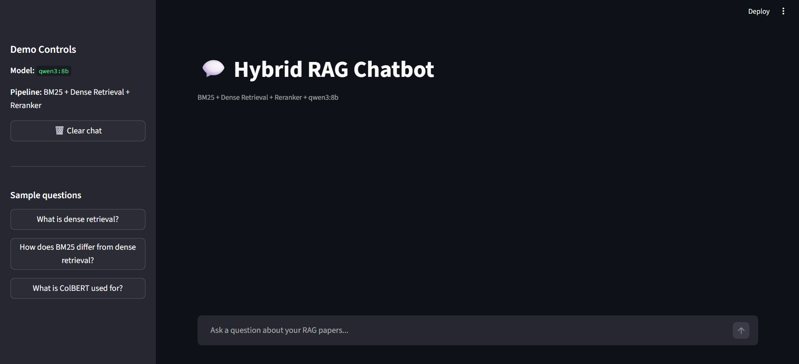
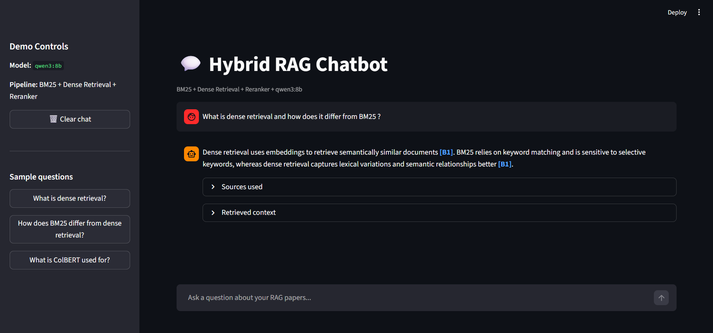

# 💬 Hybrid RAG Chatbot (BM25 + Dense + Reranker + Citations)

A **production-style Retrieval-Augmented Generation (RAG) system** that combines sparse and dense retrieval with reranking and **citation-aware answer generation**.

> Designed to demonstrate how hybrid retrieval improves factual grounding, answer quality, and explainability.

---

## 💡 Why this matters

Large Language Models can hallucinate when they lack grounding.

This project demonstrates how combining:
- Hybrid retrieval (BM25 + Dense)
- Reranking
- Citation-aware prompting

can significantly improve:
- factual accuracy
- interpretability
- trust in generated answers

---

## 🚀 Features

- 🔍 **Hybrid Retrieval**
  - BM25 (lexical)
  - Dense embeddings (semantic)
  - Fusion via Reciprocal Rank Fusion (RRF)

- 🧠 **Reranking**
  - Cross-encoder (`ms-marco-MiniLM`)
  - Improves precision of top results

- 🤖 **Local LLM (Ollama)**
  - Supports multiple models:
    - `qwen3:8b` ⭐ (recommended)
    - `llama3`
    - `mistral`
    - `phi3:mini`

- 📎 **Citation-aware answers**
  - Inline references: `[B1], [B2]`
  - Clickable → jump to source chunks

- 🖥️ **Interactive UI (Streamlit)**
  - Ask questions
  - Inspect retrieved context
  - View sources

- 📊 **Evaluation pipeline**
  - Hit@K
  - Recall@K
  - MRR@K

---

## 🧠 System Pipeline

```
User Query
↓
Hybrid Retrieval (BM25 + Dense)
↓
RRF Fusion
↓
Cross-Encoder Reranking
↓
Top-K Context
↓
LLM (Ollama)
↓
Answer + Citations [B1], [B2]
```

---

## 🧪 Example

**Question**

```
How does BM25 differ from dense retrieval?
```

**Answer**

```
Dense retrieval uses embeddings to retrieve semantically similar documents [B1], 
while BM25 relies on keyword matching and term frequency statistics [B2].
```

--- 

## 🖥️ Demo

### 🧭 Interface Overview



*Interactive UI with model selection and hybrid retrieval pipeline*

---

### 💬 Example Question & Answer


*Citation-aware answer with clickable sources and retrieved context*


## ⚙️ Setup

1. Clone the repository

```
git clone https://github.com/dimitrisl99/hybrid-rag-chatbot.git
cd hybrid-rag-chatbot
```

2. Create virtual environment 

```
python -m venv .venv
source .venv/bin/activate   # Linux / Mac
.venv\Scripts\activate      # Windows
```

3. Install dependencies

```
pip install -r requirements.txt
```

4. Ollama Setup (LLM)

This project uses a local LLM via Ollama.

**Install Ollama** 

https://ollama.com/

**Pull model**
```
ollama pull qwen3:8b
```
**Run model (optional test)**
```
ollama run qwen3:8b
```

## ▶️ Running the Full Pipeline

Follow these steps to run the full RAG pipeline:

1. Process and index documents

```
python -m src.indexing
```

2. Export embeddings / FAISS index

```
python -m src.export_index 
```

3. Run the app 

```
streamlit run app.py
```

## 📁 Project Structure

```
src/
  ├── config.py
  ├── indexing.py
  ├── export_index.py
  ├── retriever.py
  ├── reranker.py
  ├── rag_chat.py
  ├── evaluate.py

data/
  ├── raw/          # input PDFs
  ├── processed/    # generated chunks
  ├── index_numpy/  # embeddings + FAISS
  ├── chroma_db/    # vector DB
  ├── eval/         # evaluation queries
```

## 📊 Evaluation

The project includes an evaluation pipeline supporting:

- Hit@K  
- Recall@K  
- Mean Reciprocal Rank (MRR@K)  

This enables comparison between:
- Dense retrieval  
- BM25 retrieval  
- Hybrid retrieval  

### Example Results

| Method  | Hit@5 | Recall@5 | MRR@5 |
|--------|------|----------|-------|
| Dense  | 0.80 | 0.72     | 0.65  |
| BM25   | 0.76 | 0.70     | 0.60  |
| Hybrid | 0.88 | 0.81     | 0.74  |

Hybrid retrieval consistently outperforms individual methods by combining lexical precision with semantic understanding.

---

## 🧭 Future Work

- Query expansion techniques
- Improved chunking strategies
- Larger and more advanced LLMs
- More extensive evaluation benchmarks
- Support for additional document types

## 👤 Author

Dimitris Loukakis